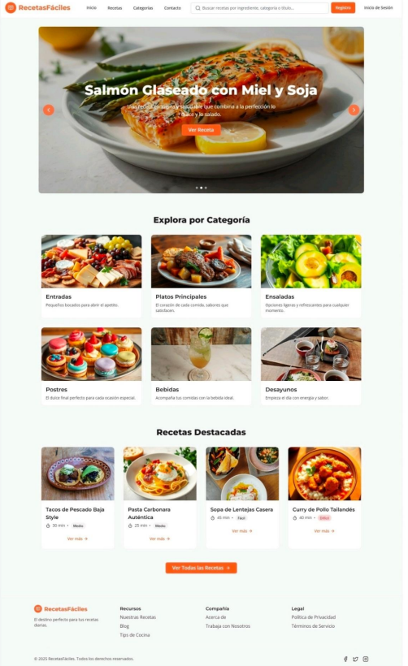

# Arquitectura del Proyecto

[← Volver al índice](index.md)

---

## 🏗️ Estructura de la Información

La arquitectura de **RecetasFáciles** está diseñada para ser escalable, mantenible y fácil de navegar.


---

## 📱 Visualización por Dispositivos

El diseño responsive se adapta a cuatro breakpoints principales:

### Desktop (1200px en adelante)

**Características:**
- Diseño en **4 columnas** para el grid de recetas
- Banner carrusel de altura completa (500px)
- Menú horizontal con todas las opciones visibles
- Barra de búsqueda expandida
- Footer en layout de 3 columnas

**Elementos destacados:**
- Hero banner con imagen grande y texto superpuesto
- Grid responsive de 4 recetas por fila
- Categorías en fila horizontal
- Espaciado amplio y generoso


---

### Tablet Horizontal (1024px)

**Características:**
- Diseño en **3 columnas** para el grid de recetas
- Banner carrusel adaptado (400px de altura)
- Menú hamburguesa implementado
- Barra de búsqueda con icono colapsable

**Adaptaciones:**
- Reducción de espaciados
- Tamaños de fuente ajustados
- Imágenes optimizadas
- Categorías mantenidas en 4 columnas

---

### Tablet Vertical (768px - 1023px)

**Características:**
- Diseño en **2 columnas** para el grid de recetas
- Banner carrusel más compacto (350px)
- Menú hamburguesa obligatorio
- Barra de búsqueda prioritaria

**Adaptaciones:**
- Grid de 2 columnas para recetas
- Categorías en 2 filas de 2 columnas
- Footer en 2 columnas o apilado
- Textos reducidos proporcionalmente



---

### Móvil (hasta 667px)

**Características:**
- Diseño en **1 columna** para todo el contenido
- Banner carrusel vertical (250px)
- Menú hamburguesa como única opción
- Barra de búsqueda con icono

**Adaptaciones:**
- Cards de recetas a ancho completo
- Categorías apiladas verticalmente
- Footer completamente vertical
- Botones táctiles optimizados (mínimo 44x44px)
- Espaciado reducido pero legible


---

## 📊 Tabla de Breakpoints

| Dispositivo | Ancho mínimo | Ancho máximo | Columnas Grid | Tipo de Menú |
|-------------|--------------|--------------|---------------|--------------|
| **Móvil** | 320px | 667px | 1 | Hamburguesa |
| **Tablet Vertical** | 668px | 1023px | 2 | Hamburguesa |
| **Tablet Horizontal** | 1024px | 1199px | 3 | Hamburguesa |
| **Desktop** | 1200px | 1920px+ | 4 | Horizontal |

---

## 🧩 Componentes Interactivos

### 1. Banner Carrusel

**Funcionalidad:**
- Rotación automática cada 5 segundos
- Controles de navegación (anterior/siguiente)
- Indicadores de posición (dots)
- Pausa automática al hacer hover

**Contenido por slide:**
- Imagen de receta destacada
- Título de la receta
- Descripción breve
- Botón "Ver Receta"

**Código JavaScript:**
```javascript
// Rotación automática del carrusel
let currentSlide = 0;
const slides = document.querySelectorAll('.carousel-slide');

function nextSlide() {
  slides[currentSlide].classList.remove('active');
  currentSlide = (currentSlide + 1) % slides.length;
  slides[currentSlide].classList.add('active');
}

setInterval(nextSlide, 5000);
```


---

### 2. Barra de Búsqueda

**Funcionalidad:**
- Búsqueda en tiempo real (al escribir)
- Filtros múltiples:
  - Por título de receta
  - Por descripción
  - Por categoría (dropdown)
- Botón de búsqueda
- Icono visual (Font Awesome)

**Comportamiento responsive:**
- **Desktop:** Siempre visible, ancho completo en header
- **Tablet:** Colapsable con icono
- **Móvil:** Modal o dropdown al tocar icono

**Código HTML:**
```html
<div class="search-bar">
  <input type="text" placeholder="Buscar recetas..." id="searchInput">
  <select id="categoryFilter">
    <option value="">Todas las categorías</option>
    <option value="postres">Postres</option>
    <option value="entradas">Entradas</option>
  </select>
  <button><i class="fa-solid fa-magnifying-glass"></i></button>
</div>
```


---

### 3. Menú Desplegable de Categorías

**Estructura:**
```
Categorías ▼
 ├── 🍰 Postres
 ├── 🥗 Entradas
 ├── 🥞 Desayunos
 ├── 🍝 Platos Principales
 ├── 🍲 Cena
 └── 🍹 Bebidas
```

**Comportamiento:**
- **Desktop:** Aparece al hacer hover
- **Móvil:** Se despliega al tocar, permanece visible
- Animación suave de aparición (transition: 0.3s)
- Cada opción con icono representativo

---

### 4. Cards de Recetas

**Información mostrada:**
- Fotografía del plato (ratio 16:9)
- Título de la receta
- Tiempo de preparación (⏱️ 30 min)
- Número de porciones (👤 4 personas)
- Nivel de dificultad (⭐ Fácil/Media/Difícil)
- Botón "Ver Receta"

**Estados interactivos:**
- **Hover:** Elevación (transform: translateY(-10px)) y sombra
- **Click:** Navegación a página de detalle
- **Favorito:** Icono de corazón (funcionalidad futura)

**Código CSS:**
```css
.recipe-card {
  border-radius: 15px;
  transition: all 0.3s ease;
  box-shadow: 0 4px 15px rgba(0,0,0,0.1);
}

.recipe-card:hover {
  transform: translateY(-10px);
  box-shadow: 0 8px 25px rgba(0,0,0,0.2);
}
```


---

## 🎨 Sistema de Grid

### CSS Grid Layout

```css
.recipes-grid {
  display: grid;
  gap: 30px;
}

/* Desktop - 4 columnas */
@media (min-width: 1200px) {
  .recipes-grid {
    grid-template-columns: repeat(4, 1fr);
  }
}

/* Tablet Horizontal - 3 columnas */
@media (min-width: 1024px) and (max-width: 1199px) {
  .recipes-grid {
    grid-template-columns: repeat(3, 1fr);
  }
}

/* Tablet Vertical - 2 columnas */
@media (min-width: 668px) and (max-width: 1023px) {
  .recipes-grid {
    grid-template-columns: repeat(2, 1fr);
  }
}

/* Móvil - 1 columna */
@media (max-width: 667px) {
  .recipes-grid {
    grid-template-columns: 1fr;
  }
}
```

---

## 🔄 Flujo de Navegación

### Flujo Principal del Usuario

```
Página Principal
    ↓
Banner Carrusel / Categorías / Búsqueda
    ↓
Grid de Recetas
    ↓
Detalle de Receta
    ↓
Ingredientes + Pasos + Información
```

### Navegación Alternativa

```
Header → Logo (Home)
Header → Categorías (Dropdown) → Categoría específica
Header → Búsqueda → Resultados filtrados
Footer → Enlaces rápidos
```

---

## 📂 Estructura de Archivos del Frontend

```
RecetasFaciles/
├── index.html
├── css/
│   ├── styles.css
│   ├── responsive.css
│   └── components.css
├── js/
│   ├── main.js
│   ├── carousel.js
│   ├── search.js
│   └── menu.js
├── img/
│   ├── recipes/
│   │   ├── brownie.jpg
│   │   ├── carbonara.jpg
│   │   └── ...
│   ├── categories/
│   │   ├── postres.svg
│   │   └── ...
│   └── logo.svg
└── fonts/
    └── (Google Fonts CDN)
```

---

## 🗃️ Arquitectura de Base de Datos *(Fase futura)*

### Diagrama Entidad-Relación

```
┌─────────────┐       ┌──────────────┐       ┌─────────────┐
│   USUARIOS  │       │   RECETAS    │       │ CATEGORÍAS  │
├─────────────┤       ├──────────────┤       ├─────────────┤
│ id (PK)     │───┐   │ id (PK)      │   ┌───│ id (PK)     │
│ nombre      │   │   │ titulo       │   │   │ nombre      │
│ email       │   │   │ descripcion  │   │   │ icono       │
│ password    │   └──<│ user_id (FK) │   │   └─────────────┘
│ rol         │       │ cat_id (FK)  │>──┘
│ created_at  │       │ tiempo       │
└─────────────┘       │ dificultad   │
                      │ porciones    │
                      │ imagen       │
                      │ created_at   │
                      └──────────────┘
```

---

[← Anterior: Perfiles de Usuario](perfiles-usuario.md) | [→ Siguiente: Guía de Estilo](guia-estilo.md)
